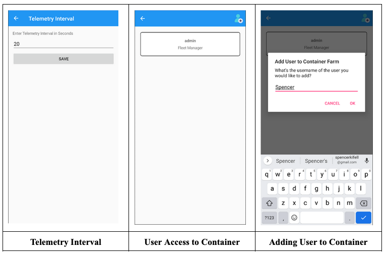

#  IoT Container Farms - BSV

## Table of Contents

 -  [Project Description](#projDesc)
 -  [IoT System](#IoT)
	- [Sensors](#sensors)
		- [Plant Sensors](#plantSensors)
		- [Geo-Location Sensors](#geoSensors)
		- [Security Sensors](#securitySensors)
	- [Cloud-To-Device (C2D)](#c2d)
	- [Contributions](#iotContributions)
- [Mobile Application](#mobileApp)
	- [App Purpose](#purpose)
	- [App Functionality](#functionality)
	- [App Snapshots](#snapshots)
	- [Future Work](#futureWork)
	- [Bonus Work](#bonus)
		- [Authentication](#authentication)
		- [Object Oriented Programming Design](#oop)
	- [Contributions](#appContributions)
- [Sample Telemetry Data Payload](#payload)

## Project Description 

-   The purpose of this project was to create an IoT solution for a fleet of container farms. A container farm is a shipping container greenhouse. Since these environments aren’t necessarily natural, they require a lot more maintenance. This being said, we used a reTerminal (Raspberry Pi) with peripherals to continuously monitor any container farm’s plants, geo-location and security data.
    
-   The entire point of this process is that the container farm will be fully automated. That being said, we utilized Azure to store telemetry data and Azure device twins to store and control the state of actuators connected to the reTerminal.

-   The hardware for each subsystem is read in Python and combined into a station to send one Telemetry payload to Azure for storage.

-   A fleet manager or a farm technician can monitor any environmental changes in a cross platform mobile application developed using Xamarin Forms. The application gives the user access to specific functionalities based on their designated role when being registered. On the application, the user has the capabilities to control and monitor the status of many container farms.

## IoT (Internet of Things) System 
### Sensors 
#### Plant Sensors 
| Sensor | Base Hat Port |
|--|--|
| Temperature / Humidity Sensor | D26 |
| Water Level Sensor | A4 |
| Moisture Sensor | A0 |
| LEDs  | D16 |
| Fan / Relay | D5 |

### Geo-Location Sensors 
| Sensor | Base Hat Port |
| -- | -- |
| GPS (AIR530) | UART |

### Security Sensors 
| Sensor | Base Hat Port |
| -- | -- |
| Noise Sensor | A2 |
| Motion Sensor | D24 |
| Door Lock | PWM |
| Door Sensor | D22 |

### Cloud To Device - C2D 

 - Communication method chosen for controlling actuators is by using **Device Twins**. 
 - We chose this method because we felt it to be the most simple choice for communicating the state of devices. With this choice, the app can set the desired properties and the station will receive the desire property, make the necessary changes and update the reported properties. The app can then reflect the reported properties.

#### Actuator Properties
	
| Keys | Possible Values |
|--|--|
| "buzzerState" | "on", "off" |
| "lightState" | "on", "off" |
| "fanState" | "on", "off" |
| "doorLockState" | "on", "off" |

#### Other Properties

| Keys | Possible Values |
|--|--|
| "telemetryInterval" | *Any positive integer value* |

### Contributions 

## Mobile Application 
### Application Purpose 

 - The purpose of this application is to communicate with farm container devices and display collected data to the user. The user can also control certain actuators with the application. The purpose of this is to create an application that farmers and managers of a container farm can use to monitor and update all necessary information/states of the container farm.

### Application Functionality 

 - Registration
	 - The application allows you to create a local account with the option to be a fleet manager or a farm technician which will determine your access to views and controls.

- Login
	- After you have signed up, you will be able to login to the application using your credentials that will be locally authenticated.

- Manage Container Farms
	-   Fleet Managers can then add, edit and delete container farms. Select the container farm to view additional data and controls. Farm technicians only have access to container farms when they have been added to one by a fleet manager.

-   Add Users to Container Farms 
	- Fleet managers can add farm technicians and other fleet managers to container farms they created. All your container farms will be displayed in the container farm view where you can select the container farm that you want to work with.
    
-   View Measurements
	- Once you have selected a container farm, you can view data collected by the plant, security and geo-location sensors by using the bottom navigation to visit each tabbed page. To get this data, you must refresh the page using the refresh button in the top menu bar. Refreshing the page gets the data from azure and displays it to the user.
    
-   Control Actuators 
	- You now also have the option to control plant, security and geo-location actuators from the application by clicking the controls icon in the top menu bar from each subsystems page.

-   View Charts Page
	-  In the bottom navigation you also have access to a charts page which allows you to select a container farm property and the number of data points you want displayed and it will generate a graph for the user to see how the property has behaved over time.
    
-   Modify Telemetry Interval
	- The user can modify the telemetry interval by clicking the clock icon in the top menu bar and saving a desired interval.
    
-   Map View 
	- Lastly, the user can long press the longitude latitude measurement to access a map with the current location of the container farm.

### Application Snapshots 

### Future Work 
-   A demo view for guests to see how the application works, this way they could decide if they want to purchase the service or not.
-   The user would have the option to install additional hardware. (i.e. extra fans, sensors)

-   Implement a settings fragment
    -	Having themes (changing the color scheme on the fly).
	-  Multiple languages (be able to toggle that app between english and french.)
	-  If this app was to roll out on a global basis, we should offer a variety of different units for measurements. (ie. C -> F, mL -> L)
    
-   Use of storage in IoT Hub
	-   Storing historical data to present to users with a detailed history.
    
-   Add more users, so that others can monitor the state of the farm without having any controls.
    
-   Azure active directory for authentication instead of doing it locally.
    
-   Using a salt to properly hash the passwords and any other sensitive data being stored.
    
-   Survey others using our application to get feedback on user experience and design and implement any suggestions that coil improve the application.

-   Create a detailed user manual to describe the intended use of each feature and how it works.

### Bonus Work 

#### Authentication 

 - We implemented local authentication for our application. This being said, we used the SQLite ORM (however, not the same package we used in class, this one supported multi-relational databases where children models were stored.)
 - We didn’t use Azure Active Directory or Auth for this particular project, mainly because we didn’t believe we had enough time to get our hands dirty with cloud authentication. As mentioned in our future work section, the plan would be ideally to look into the Azure Active Directory for authentication since Microsoft technologies and products integrate into each other very efficiently.
 - Nuget packages used
	 - SQLite-net (1.6.292)
		 - Used as the general ORM for the multi-relational database.
	-	SQLiteNetExtension (2.1.0)
		-	Used as an extension to the ORM (Data annotations)
- Beyond authentication, roles were also assigned to users, that being said dependent on the user's role, they had access to different aspects of the application.
- Something regarding authentication that we also plan on looking into is using a salt and hashing the user’s passwords/personal connection strings.

#### Object Oriented Programming Design 
- Models 
	- User
		- This model is used to store the user's data.
	- Container Farm
		- This model is used to store the container farm's data.
	- Container Farm User
		- This model is used to represent the many to many relationship between users and container farms.
	- Telemetry
		- This model represents telemetry data for specific containers.
	- Vibration
		- This model represents vibration objects to be contained within a telemetry object/model.

### Contributions 

## Sample Telemetry Data Payload 

    {  
	    "BuzzerIsActive": true,  
	    "Door": false,  
	    "DoorIsLocked": true,  
	    "FanIsActive": true,  
	    "Humidity": 50,  
	    "Latitude": -46.6,  
	    "LightIsActive": true,  
	    "Longitude": -23.5,  
	    "Luminosity": 0,  
	    "Moisture": 20,  
	    "Motion": true,  
	    "Noise": 20,  
	    "Pitch": 0,  
	    "Roll": 0,  
	    "Temperature": 25,  
	    "Vibration": {"X": 25, "Y": 12, "Z": 76},  
	    "WaterLevel": 10  
    }
